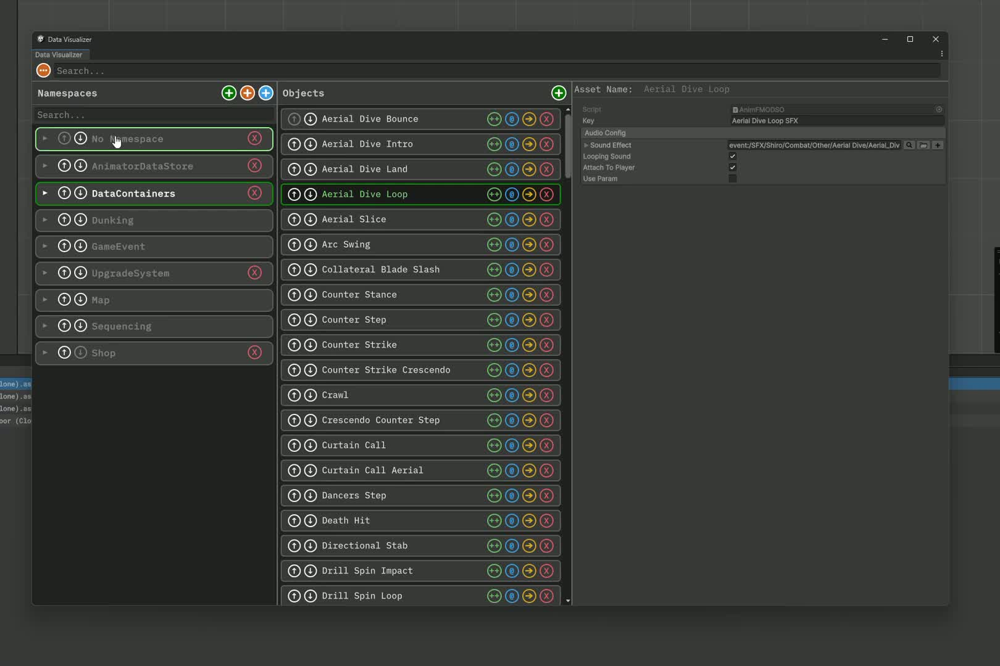
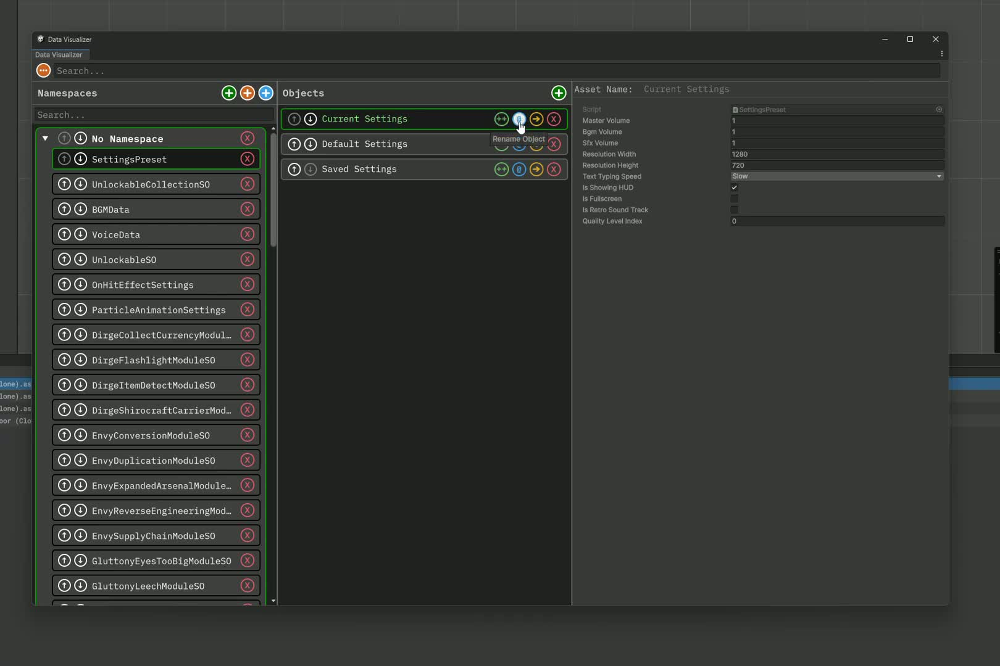
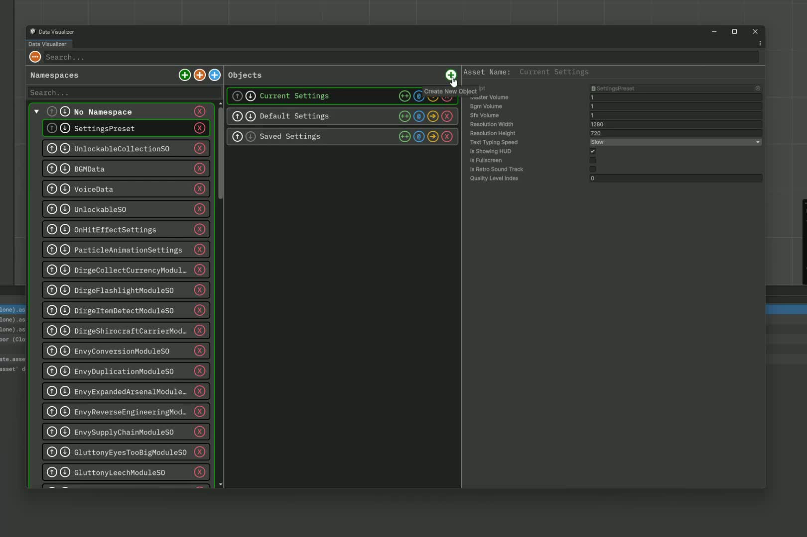
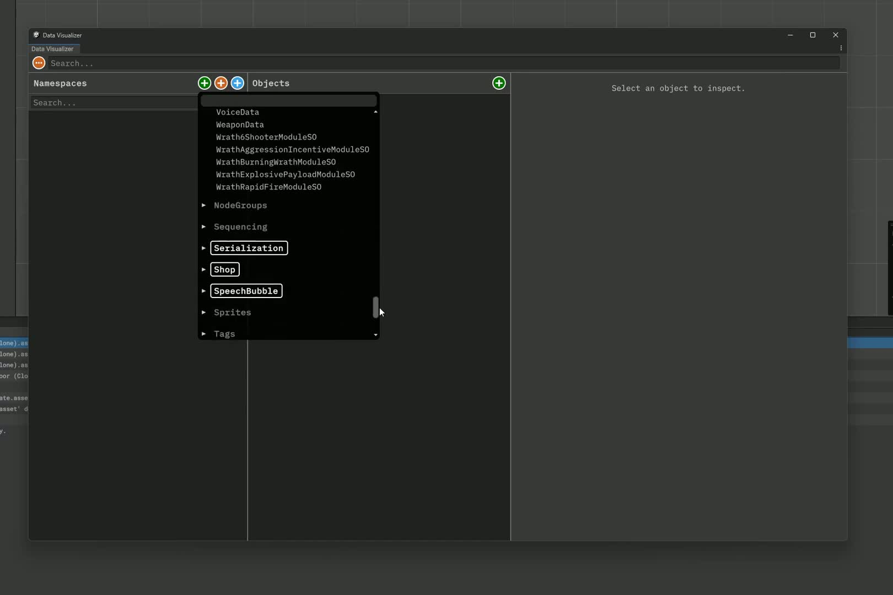

# Data Visualizer

Data Visualizer streamlines working with ScriptableObject-heavy systems by centralizing asset management, inspection, and batch operations in a single window. Instead of hunting through the Project panel and repeatedly switching contexts, you get a namespace-organized view of all your data types with inline editing, batch operations, and workflow automation.

This guide captures the key points from the companion [video walkthrough](https://youtu.be/3oUxUSKNyhw) while keeping the instructions project-agnostic.

## Getting Started

Open **Tools → Walltop Studios → Data Visualizer** and dock it alongside the Inspector. The tool persists your layout, selection, and tracked types between sessions, so you can jump back into your workflow immediately.

## Window Layout

*Full window overview at 00:27 in the walkthrough video.*

The window uses a three-panel layout:

**Namespace & Type Panel (left)** organizes ScriptableObject types by C# namespace. Click a namespace to expose its types, then select a type to load all instances. Reorder namespaces and types with drag-and-drop or arrow buttons—your ordering persists across sessions.

**Objects Panel (center)** lists every instance of the selected type. Multi-select works with standard Unity shortcuts for batch operations. Arrow buttons let you reorder instances without dragging through long lists.

**Inspector Panel (right)** displays the full inspector for selected assets, including Odin Inspector integrations and custom editors. Changes save immediately, just like Unity's default Inspector.

## Instance Management

*Instance actions demo at 03:35.*

Asset management controls live above the Objects panel:

**Clone** duplicates the selected asset with a "Clone" suffix in the same folder as the original. Useful for creating variants without leaving the window.

**Rename** opens a draggable prompt that renames the asset on disk. No need to coordinate between multiple panels or windows.

**Move** retargets assets to different folders. The tool remembers your last location to speed up batch moves and prevents redundant operations.

**Delete** removes assets permanently after confirmation. Click elsewhere or hit cancel to abort.

Inspector edits save immediately. Your selection persists when switching between types, so you can jump between data categories without losing context.

## Creating Assets

*New asset workflow at 06:45.*

The **Create** button spawns a new instance of the active type in your configured **Data Folder** (see Settings below). Clones stay beside their originals regardless of the Data Folder setting. Chain create with rename or move to place new assets exactly where you need them.

## Building Your Type Catalog

*Adding ScriptableObject types around 12:45.*

Three controls above the Namespace panel populate your catalog:

**Search Types** queries Unity's known ScriptableObject types. Add individual types or entire namespaces in one operation.

**Scan Asset Folder** crawls a folder recursively, discovering all ScriptableObject types and wiring up existing instances. Ideal for bootstrapping Data Visualizer on established projects.

**Scan Scripts Folder** targets source folders containing ScriptableObject classes. Use this when you've written new types but haven't created any assets yet.

Removing types or namespaces is non-destructive—it only stops Data Visualizer from tracking them. Your assets remain untouched on disk.

Organize the catalog to match your team's mental model. The structure persists across sessions, so everyone can navigate consistently.

## Search & Filtering

The filter field above the Namespace list narrows types and namespaces with case-insensitive matching. The global search box above the Objects panel finds text across all loaded instances, letting you jump directly to specific assets without manual scanning.

## Settings

*State management settings at 18:20.*

**Persist state in user settings** stores layout, ordering, and tracked types in your local user cache instead of a shared project asset. Enable this to avoid merge conflicts when multiple developers customize their own workspace.

**Select active object** syncs selection between Data Visualizer and Unity's Inspector window. Useful for cross-referencing assets in other editor windows.

**Data Folder** defines where new assets land. Click to ping the current folder or browse to set a new default.

## Extensibility

Data Visualizer exposes several extension points for custom workflows:

**Attributes** let you override display namespace or friendly names on ScriptableObject classes. Useful when code organization doesn't match your content taxonomy.

**BaseDataObject** provides a ready-made base class for ScriptableObjects with built-in lifecycle support:
- Centralizes namespace/type metadata so derived types inherit correct grouping automatically
- Implements lifecycle interfaces (clone, create, rename, delete) with virtual hooks like `OnBeforeClone`, `OnAfterClone`, and `OnValidateRename`
- Exposes helper methods for common operations (ping asset, select in Project, open related scenes)

Derived classes override only what they need—GUID generation, cache resets, companion asset syncing—without duplicating boilerplate.

**Lifecycle Interfaces** hook into asset events (before/after clone, rename, delete, create). Enforce invariants like regenerating IDs or pushing audit logs to telemetry without writing per-asset editor scripts.

**UI Toolkit Extensions** render custom UI alongside the default inspector. Return a `VisualElement` tree—graphs, thumbnails, validation badges, or any UI Toolkit component—and Data Visualizer slots it in automatically. Because the entire window runs on UI Toolkit, this approach scales to complex dashboards without leaving the unified workflow.

## Workflow Tips

**Treat namespace ordering as shared navigation** when persisting state in the project asset. A consistent structure reduces friction when different team members jump into the same data.

**Set the Data Folder to your team's content root.** Predictable asset locations keep version control diffs clean and make batch operations safer.

**Use clone + move for cross-folder duplication.** Faster and more controlled than dragging through the Project window, especially when working with deep folder hierarchies.

The [video walkthrough](https://youtu.be/3oUxUSKNyhw) provides a step-by-step visual tour and explains the rationale behind UI choices.

# Overview
This is currently *ALPHA* software, intended for wallstop studios internal use only. Feel free to use. Currently there is no support and there may be breaking changes. Once stabilized, I will ready this repo for production use.

## Contributing

This project uses [CSharpier](https://csharpier.com/) with the default configuration to enable an enforced, consistent style. If you would like to contribute, recommendation is to ensure that changed files are ran through CSharpier prior to merge. This can be done automatically through editor plugins, or, minimally, by installing a [pre-commit hook](https://pre-commit.com/#3-install-the-git-hook-scripts).