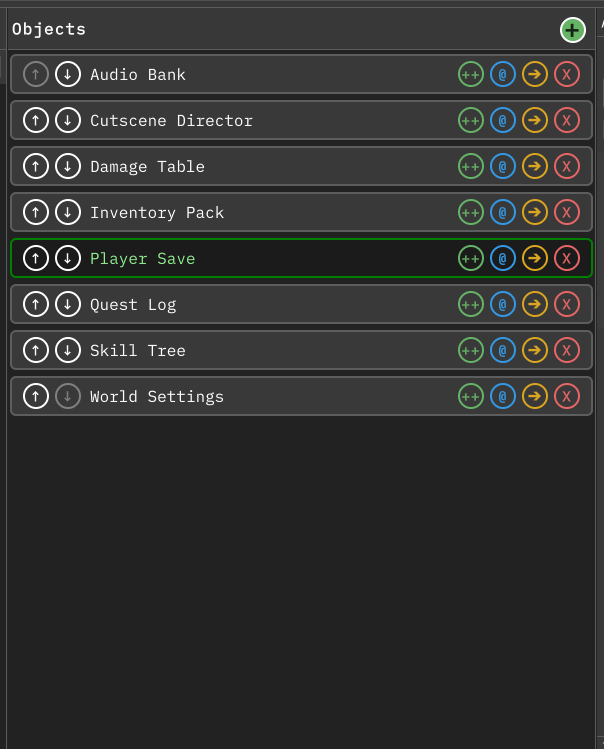

# Managing assets

This page covers the operations that change assets on disk, and the processors
that change many at once. Everything here is refused while the window is paused
for Play Mode; see [While the editor is playing](organizing.md#while-the-editor-is-playing).

## Where an action lives

**Create** is the **+** button in the object list header; it always acts on the
selected type.

**Clone**, **Rename**, **Move**, and **Delete** are the four buttons on the right
of each object row, and they act on that row's object without selecting it first.

*Per-row asset management controls. Regenerated from the live window by the docs
capture pipeline.*

## Create

**Create** asks for a name, prefilled with the type's display name, and refuses a
blank name or one containing a character that is invalid in a file name.

The asset is written to a per-type folder under your **Data Folder**, using the
type's full name with each `.` replaced by a directory separator. For
`MyGame.Items.WeaponData` with a Data Folder of `Assets/Data`, the asset lands in
`Assets/Data/MyGame/Items/WeaponData/`. Those folders are created for you.

If the name is already taken, nothing is written. When the existing asset is the
same type it is selected and shown, and the dialog says so.

## Clone

**Clone** copies the selected asset into the same folder as the original, and
inserts the copy directly after the original in the list, then selects it.

Naming strips any existing `(Clone)` or `(Clone n)` from the source file name
first, so repeated clones do not accumulate suffixes. The first clone is
`(Clone)`, then `(Clone 1)`, `(Clone 2)`, and so on. Unity's own unique-path
check breaks any remaining collision.

Clones always stay beside their original. Your **Data Folder** does not affect
them.

## Rename

**Rename** asks for a new name without the extension and validates it before
touching the asset. The dialog reports `Invalid name.` for a blank name or an
invalid character, `Name is unchanged.` when nothing differs, and Unity's own
`Invalid: …` message when the move would be rejected, for example onto an
existing file.

The asset keeps its folder; only the file name changes.

## Move

**Move** opens a folder picker starting in the asset's current folder. The target
must be inside the project's `Assets` directory; anything else is refused with an
**Invalid Folder** dialog. Moving an asset to the folder it is already in does
nothing.

The asset keeps its file name.

## Delete

**Delete** asks for confirmation, naming the asset. Confirming removes the `.asset`
file. Cancel does nothing.

## Processors

The **Processors** area sits below the namespace panel. It lists every
`IDataProcessor` implementation in your project whose `Accepts` list covers the
selected type, sorted by name. A processor with no `Accepts` list applies to every
type. The collapsed header shows how many processors are listed; the area is
hidden entirely when none apply.

Clicking a processor opens a confirmation that names the processor and the number
of objects it will receive. Confirming runs `Process`, saves assets, refreshes the
AssetDatabase, and schedules a window refresh. A processor that throws is caught:
the exception is logged and an **Error running processor '…'** dialog reports the
message. Other processors are unaffected.

### ALL and FILTERED

The **ALL** / **FILTERED** switch above the processor list sets the scope.

- **ALL** passes every loaded instance of the selected type.
- **FILTERED** passes only the instances the [label filter](search-and-filter.md#label-filter)
  currently shows. With no label filter, that is the same set as **ALL**.

**FILTERED** is the default.

### Refusal while loading

Instances stream in asynchronously. Running a processor while the selected type
is still loading would touch only the subset that has arrived while the dialog
implied the whole type, so the run is refused with a **Loading In Progress**
dialog. Wait for the load to finish, then run it.

Processors are also refused during the Play Mode pause, and the switch is
disabled while the window is paused.

## Undo

These operations are not on Unity's undo stack. Clone, rename, move, and delete
change files directly. Inspector edits go through Unity's own serialized-object
path and do support undo.

## Next steps

- [Search and filtering](search-and-filter.md) — find objects and narrow them by
  label.
- [Organizing your data](organizing.md) — ordering, layout, persistence, and the
  Play Mode pause.
- [Extending the window](extending.md) — write your own processors.